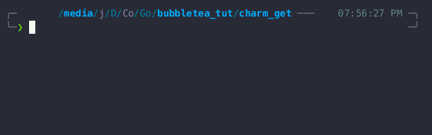

# charm_get

A simple terminal application that bootstraps a new Bubble Tea project by allowing users to specify the project name and then installs the necessary Go packages.

## Features

- Interactive terminal UI for entering the project name.
- Automatically creates a `go.mod` file.
- Installs essential Go packages for Bubble Tea.
- Displays a spinner and progress bar during installations.
- Gracefully handles installation errors.

## Demo



## Getting Started

### Installation

1. Clone the repository:

   ```bash
   git clone https://github.com/Jitesh117/charm_get.git
   cd charm_get
   ```

2. Build the binary:

   ```bash
   go build -o charm_get
   ```

3. Add the binary to your PATH:

   For Unix-like systems (Linux, macOS), you can move the binary to a directory that's already in your PATH, like `/usr/local/bin`:

   ```bash
   sudo mv charm_get /usr/local/bin/
   ```

   Alternatively, you can add the current directory to your PATH by adding this line to your shell configuration file (e.g., `~/.bashrc`, `~/.zshrc`):

   ```bash
   export PATH=$PATH:/path/to/charm_get/directory
   ```

   For Windows, you can add the directory containing the `charm_get.exe` to your system's PATH environment variable through the System Properties dialog.

### Usage

1. Run the application from anywhere:

   ```bash
   charm_get
   ```

2. Enter the project name when prompted.

3. The application will create a `go.mod` file and install the necessary packages.

4. Monitor the progress of the installations in real-time!

## Development

If you want to run the application without creating a binary:

```bash
go run main.go
```

This will execute the application directly from the source code.
